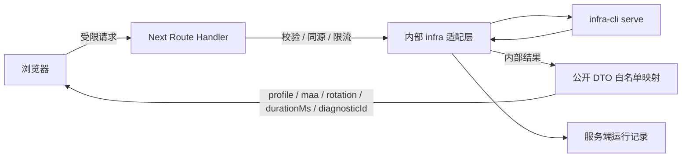
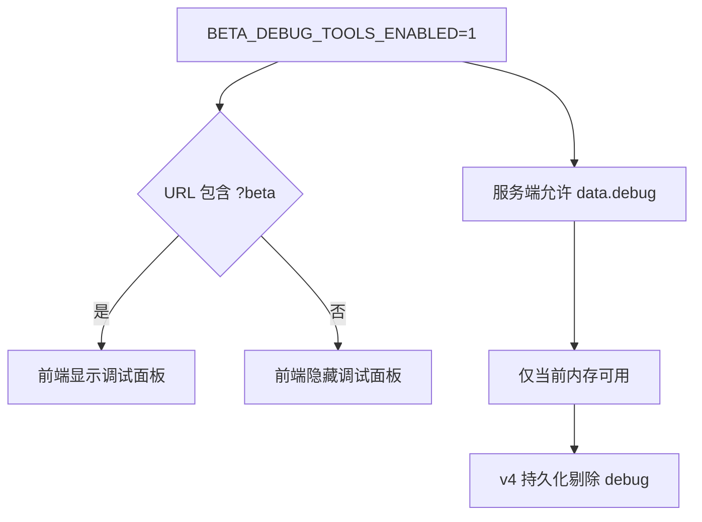
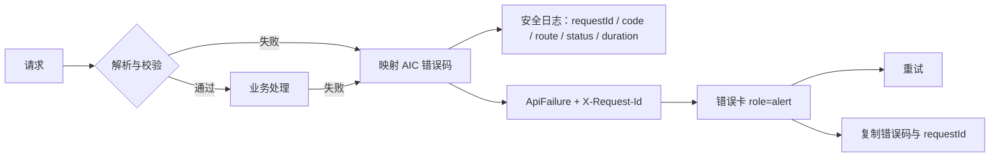
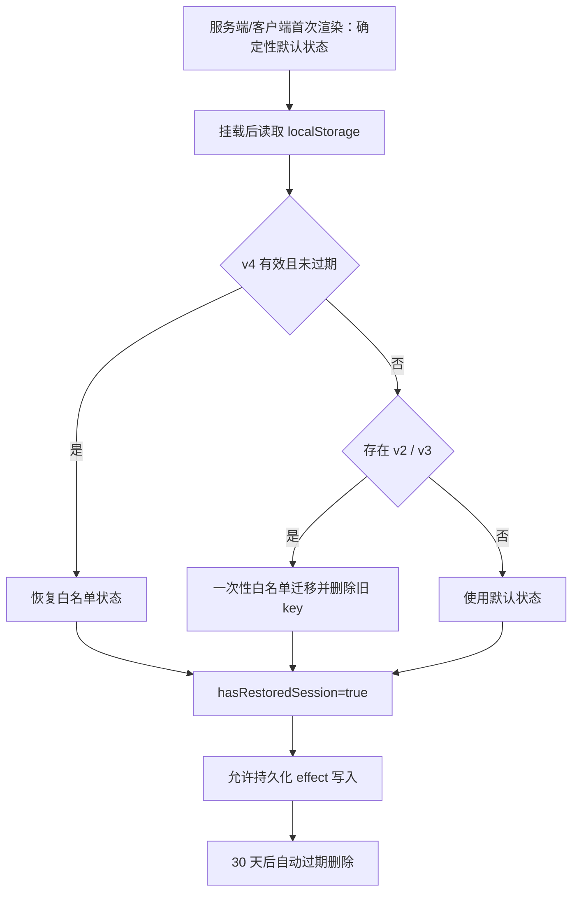

# 明日方舟基建排班助手上线产品化报告

## 执行摘要

本次改造把前端从 beta 验收工作台收敛为正式产品“明日方舟基建排班助手”，重点完成用户文案、公开 API 白名单、统一错误码、请求保护、反馈最小化、v4 本地持久化、hydration 修复和自动化门禁。实施日期为 2026-07-28，工作分支为 `codex/frontend-production-readiness`，起始提交为 `387dd66`，前端改造提交为 `cde1cec`，发布前边界加固提交为 `04377b4`，合并提交为 `01e5085`。

改造分支已推送到 fork，PR [#46](https://github.com/KnightCodeSquareMatrix/ArknightsInfraCalc-v2_beta_test_frontend/pull/46) 已合并。`main` push 的 [Frontend quality](https://github.com/KnightCodeSquareMatrix/ArknightsInfraCalc-v2_beta_test_frontend/actions/runs/30367945588) 工作流全部通过，合并提交已发布到 `/opt/arknights-infra/releases/20260728222529-01e5085`。

本次明确保持不变：

- `Full E2 测试`名称、计划安排卡片右上角位置和主按钮层级；
- “基建计算器 / 练卡建议 / 森空岛状态”三个同级导航；
- 手机端“一图流布局”继续显示为禁用态，不隐藏；
- 加工站继续使用现有“暂不显示”按钮与隐藏/恢复交互。

求解算法、CLI 协议、核心仓库和 CLI 运行记录格式均未修改；反馈记录按本次公开契约改为最小化结构。

## 改造前问题基线

### 已有核心流程

改造前曾在真实 Chromium 中验证：

- `Full E2 测试`可以载入 243 全精二数据并生成三班排班；
- 桌面视口和 390px 手机视口可以操作；
- 三班切换和房间排班可以展示。

这说明产品主链路可用，但上线边界、可恢复性和信息暴露仍不足。

### hydration mismatch

复现步骤：

1. 载入 Full E2；
2. 生成排班；
3. 等待结果写入浏览器本地数据；
4. 刷新页面；
5. 在 Console 观察 React hydration mismatch。

根因是旧 `App.tsx`在组件渲染阶段直接调用 `readSessionState()`读取 `localStorage`。服务端渲染得到空默认状态，客户端首次渲染却直接使用已保存结果，两棵树不一致。旧持久化 effect 还会保存完整 `result`、反馈草稿和调试对象，扩大了错误与泄露面。

### 旧公开响应暴露

旧 `/api/health`可能返回：

- `cliPath`
- `serve.pid`
- CLI candidates
- `coreRoot`、`repoRoot`
- fixture、data、storage、feedback、run 绝对路径
- 原始 `serveError`

旧 `/api/plan`可能返回：

- CLI 路径和命令
- stdout / stderr
- debug bundle
- run/result 绝对路径与相对路径
- serve request / response
- 原始异常字符串

旧 `/api/feedback`返回反馈目录、issue、operbox 和 debug bundle 的服务器路径，并要求浏览器重复上传完整 operbox 与 debug bundle。

旧错误响应以自由字符串为主，多数失败被统一为 400，没有稳定错误码、requestId、retryable 或字段级错误，前端只能显示原始工程异常。

## 改造前后对照

| 范围 | 改造前 | 改造后 |
| --- | --- | --- |
| 产品名称 | Beta、验收台、CLI 工程语气 | 明日方舟基建排班助手 |
| 顶部状态 | CLI 路径、协议、耗时、原始错误 | 已就绪 / 正在生成 / 已生成 / 暂不可用 |
| 数据文案 | Box、layout JSON、CLI schema | 首次“干员数据（Box）”，后续“干员数据”；布局文件进入高级设置；效率概览/详情 |
| 练卡建议 | `plan.compute`、`profile.actions`、CLI 建议 | 用户语言、可执行空状态 CTA |
| 反馈 | 上传完整 operbox/debug，返回服务器路径 | 只传诊断编号、房间、说明、consent；只展示反馈编号 |
| health | 内部路径、PID、候选 CLI、存储目录 | 服务状态、森空岛可用性、安全 feature flags |
| plan | 直接暴露内部运行对象 | 构造白名单 DTO；生产无调试字段 |
| 错误 | 自由字符串、常见统一 400 | AIC 错误码、HTTP 映射、requestId、retryable、fieldErrors |
| 本地保存 | 渲染期读取，保存完整结果 | 挂载后恢复、v4 白名单、30 天过期、迁移和清理 |
| 调试开关 | `?beta`即可显示 | 服务端 flag 与 `?beta`同时满足 |

### 公开数据流



### 调试数据流



服务端关闭 flag 时，即使 URL 带 `?beta`也不会下发调试字段，health 的 `debugTools`为 false，前端不渲染调试 UI。

### 错误处理流



### v4 持久化生命周期



## 公开接口示例

### 成功响应

```json
{
  "success": true,
  "data": {
    "profile": { "schema_version": 4, "actions": [] },
    "maa": { "title": "明日方舟基建排班助手 · 243", "plans": [] },
    "rotation": {
      "profile": "abc_12_6_6",
      "shifts": [],
      "daily": { "trade": 0, "manu": 0, "power": 0 }
    },
    "durationMs": 529,
    "diagnosticId": "5f4d8e52-26e3-4ceb-9f31-6cf830ff1a0b"
  },
  "requestId": "a6a4c73c-3e02-4923-b90b-ecb4b1ca3708"
}
```

### 失败响应

```json
{
  "success": false,
  "error": {
    "code": "AIC-LAYOUT-1201",
    "message": "基建设施配置无效，请检查布局。",
    "requestId": "2d5fd641-71c2-4eb1-a29e-4f158db2440e",
    "retryable": false,
    "fieldErrors": [
      {
        "path": "layout",
        "code": "invalid_layout",
        "message": "布局最多包含 64 个房间。"
      }
    ]
  }
}
```

### 反馈请求

```json
{
  "diagnosticId": "5f4d8e52-26e3-4ceb-9f31-6cf830ff1a0b",
  "room": {
    "id": "trade_1",
    "title": "贸易站 1",
    "group": "trading",
    "operators": ["但书", "龙舌兰", "巫恋"]
  },
  "note": "此处站位与预期不一致。",
  "consent": true
}
```

## 错误码目录

| 错误码 | HTTP | 含义 |
| --- | ---: | --- |
| `AIC-REQ-1001` | 400 | JSON 无法解析 |
| `AIC-REQ-1002` | 413 | 请求体过大 |
| `AIC-BOX-1101` | 422 | 干员数据无效 |
| `AIC-LAYOUT-1201` | 422 | 基建设施配置无效 |
| `AIC-AUTH-2001` | 401 | 森空岛登录过期 |
| `AIC-AUTH-2002` | 403 | 请求来源无效 |
| `AIC-AUTH-2003` | 503 | 森空岛登录暂不可用 |
| `AIC-AUTH-2004` | 409 | 森空岛账号数量已达上限 |
| `AIC-PLAN-3001` | 503 | 排班服务未就绪 |
| `AIC-PLAN-3002` | 429 | 已有排班任务或请求过频 |
| `AIC-PLAN-3003` | 504 | 排班计算超时 |
| `AIC-PLAN-3004` | 502 | 求解器响应无效 |
| `AIC-FEEDBACK-4001` | 422 | 反馈内容无效 |
| `AIC-FEEDBACK-4002` | 500 | 反馈保存失败 |
| `AIC-SYS-5000` | 500 | 未预期错误 |
| `AIC-RATE-6001` | 429 | 接口频率超限 |
| `AIC-LOCAL-7001` | 前端 | 浏览器本地保存失败 |

429 响应带 `Retry-After`。`AIC-LOCAL-7001`是非阻塞提示，不阻止生成或导出排班。

## 开发流程的明显变化

| 过去 | 现在 |
| --- | --- |
| 主要依赖本地 lint/build | PR 自动执行 lint、单测、契约测试、构建和 E2E |
| 内部对象可被 route 直接返回 | 公共 DTO 必须经过白名单 mapper |
| 没有泄露回归门禁 | 递归检查 forbidden internal fields |
| hydration 依赖人工发现 | 预置 v4、刷新和 Console 监听成为 E2E |
| UI 检查以桌面为主 | 固定检查 390px、768px、1440px |
| 错误文本散落 | 错误码目录、HTTP 映射、客户端错误卡统一 |

公共 DTO 变更必须同时更新 mapper 与泄露测试。错误码新增或修改必须同步更新类型、映射测试和本报告目录。UI 修改必须检查三个一级导航和两处锁定区域，不得把“一图流布局”在手机端隐藏，也不得替换加工站“暂不显示”。

GitHub Actions 工作流位于 `.github/workflows/frontend-quality.yml`，使用 Node 22，并按以下顺序执行：

1. `npm ci`
2. `npm run lint`
3. `npm test`
4. `npm run test:api-contract`
5. `npm run build`
6. 安装 Playwright Chromium
7. `npm run test:e2e`

## 开发调试环境使用指南

### 启动调试模式

Windows PowerShell：

```powershell
$env:BETA_DEBUG_TOOLS_ENABLED='1'
$env:BETA_RATE_LIMIT_ENABLED='0'
npm run dev
```

访问：

```text
http://127.0.0.1:5174/?beta
```

### 排查 hydration

1. 打开 Full E2，生成排班。
2. 刷新页面。
3. 在 Console 搜索 `hydration`、`did not match`或 React recoverable error。
4. 在 Application → Local Storage 查看 `arknights-infra-calc-session-v4`。
5. 确认存在 `savedAt`、`expiresAt`，并确认 result 内没有 `debug`、路径、stdout、stderr、反馈草稿。
6. 检查损坏或过期值能被删除，且恢复完成前页面只显示稳定骨架。

### 排查接口泄露

1. 打开 Network，依次检查 health、plan、feedback。
2. 生产 feature flag 下确认响应没有 `cliPath`、candidate、PID、仓库路径、存储路径、command、stdout、stderr、debug bundle、serve request/response。
3. plan 只应有 profile、maa、rotation、durationMs、diagnosticId。
4. feedback 响应只应有 feedbackId 与 savedAt。
5. sample 的来源名称固定为“243 全精二示例”，不得出现 fixture 路径。

### 按 requestId 定位错误

1. 从错误卡复制错误码和 requestId。
2. 本地终端按 requestId 搜索 Next 日志。
3. 服务器使用：

```bash
journalctl -u arknights-infra --no-pager | grep '<requestId>'
```

4. 日志应只包含 requestId、code、route、status、durationMs，不应打印请求正文或会话。

### 模拟错误状态

- 提交缺少控制中枢或超过 64 个房间的布局，验证 422 与 `AIC-LAYOUT-1201`。
- 在 DevTools Network 选择 Offline，验证可重试网络错误和错误 live region。
- 使用自动化测试模拟 CLI 未就绪、超时、无效响应和限流，避免污染真实服务。
- 本地契约测试验证 413、429、`Retry-After`、同源拒绝和 feedback consent。

### 限流与大小限制

只在本地自动化环境测试 429、413 和 `Retry-After`，禁止通过重复请求压测线上服务。需要关闭人工调试限流时只在本地设置：

```powershell
$env:BETA_RATE_LIMIT_ENABLED='0'
```

生产必须恢复 `BETA_RATE_LIMIT_ENABLED=1`和 `BETA_TRUST_PROXY_HEADERS=1`。

### 响应式与可访问性

在设备工具中依次检查 390px、768px、1440px：

- Full E2 和生成排班主按钮位置；
- 三个一级导航；
- 状态 `role="status"`、错误 `role="alert"`；
- 键盘焦点、反馈弹窗 consent、错误重试和复制诊断编号；
- 手机端主要触控目标至少 44px；
- 手机端“一图流布局”仍然可见且禁用；
- 加工站仍有“暂不显示”并可恢复。

### 切换公开/调试模式

1. 开启 flag 并访问 `?beta`，调试面板应出现。
2. 去掉 `?beta`，即使 flag 开启也不显示面板。
3. 关闭 `BETA_DEBUG_TOOLS_ENABLED`后重启服务。
4. 再访问 `?beta`，调试 UI 和 `data.debug`都不得出现。

## 验证与发布结果

截至 2026-07-28，本地实际执行：

| 命令 | 结果 |
| --- | --- |
| `npm run check` | 通过；49 个单元/持久化测试 + 13 个 API 契约测试 |
| `npm run build` | 通过；Next 生产编译、TypeScript 和 8 个页面/路由生成完成 |
| `npm run test:e2e` | 通过；7 条 Chromium E2E |
| `npx playwright test -g "responsive navigation"` | 通过；1 条响应式与锁定区域回归 |
| 真实 `/api/plan` Full E2 | 通过；11.151 秒生成 3 个班次，公开 data 仅有 5 个白名单字段 |
| 真实 `/api/feedback` | 通过；响应 data 仅有 `feedbackId`、`savedAt` |
| GitHub Actions `Frontend quality` | 通过；Node 22 下的安装、lint、单测、契约测试、生产构建和 7 条 Chromium E2E 全部成功 |

已验证的浏览器范围：

- Chromium；
- 390×844、768×900、1440×900；
- v4 预置排班刷新后 Console 无 hydration 错误；
- Chrome 扩展在根元素注入 `data-fabric-scheme`时不再触发 hydration mismatch，应用子树仍保留严格 hydration 检查；
- 生产 `?beta`不显示调试 UI；
- server flag + `?beta`显示调试 UI；
- Full E2 载入、生成、三班切换、MAA 下载、反馈编号；
- 手机端一图流保持显示且禁用；
- 加工站“暂不显示”及恢复交互。
- 设置清除 v2/v3/v4/onboarding，且没有发出森空岛退出请求。

接口自动化已覆盖错误码状态、413、同源检查、数量边界、限流、`Retry-After`、反馈 consent、health 503、生产字段泄露、debug flag。持久化自动化已覆盖 v2/v3 迁移、30 天过期、损坏 JSON、写入配额失败、清理和调试字段剔除。

本地还验证了 Next 以 `-H 0.0.0.0`监听、浏览器从 `127.0.0.1`访问的场景：同源校验使用实际 `Host`，合法请求不再误报 `AIC-AUTH-2002`；无效布局继续进入 422 `AIC-LAYOUT-1201`。

### 线上发布结果

- release：`/opt/arknights-infra/releases/20260728222529-01e5085`；
- 当前软链与 `.release-sha`：`01e5085d47c55e32d04ab0389852f4b7962d8116`；
- systemd：`arknights-infra`为 `active`；
- 内部端口：Next 仅监听 `127.0.0.1:4175`；公网入口为 Nginx `4174`；
- 内部和公网 `/api/health`均返回 200，`plannerReady: true`、`debugTools: false`、`rateLimit: true`；
- 生产环境新增 `BETA_DEBUG_TOOLS_ENABLED=0`、`BETA_RATE_LIMIT_ENABLED=1`、`BETA_TRUST_PROXY_HEADERS=1`和公开 Origin；
- `/var/lib/arknights-infra`及其 `cli-runs`、`feedback`目录保持原位置和所有权；
- 真实 Chromium 从公网载入 Full E2，生成 3 个班次，刷新后恢复排班，Console 为 0 error / 0 warning；
- 真实 plan 响应 data 仅有 `profile`、`maa`、`rotation`、`durationMs`、`diagnosticId`，递归检查未发现内部字段；
- 真实反馈编号为 `611f5dc1-8557-420c-bfe8-5cc18134f9ea`，响应 data 仅有 `feedbackId`、`savedAt`，服务端只落盘 `meta.json`与`issue.json`。

### 未纳入本阶段

- 没有修改 `infra-cli`算法、协议或核心仓库。线上旧求解器哈希仍为 `70771355df6661a08f8162acc972523dcdf9fc23ad03f1da93e0a5416b052d09`，真实 Full E2 已证明兼容；
- 核心仓库最新 `main`在本次审计时有 7 个自身测试失败，因此没有绕过核心门禁强制更新求解器；
- 没有实现服务端历史数据自动清理任务。

### 已知风险

- 限流是单实例进程内状态，重启会清空，不适合未来多实例水平扩展；若扩容需迁移到共享存储。
- 反馈只保存诊断编号与房间摘要，依赖服务端 CLI 运行记录仍在保留期内。
- 自动化 E2E 使用固定 fixture 与接口拦截；本次已额外完成真实公网 CLI 冒烟，但今后每次更新求解器仍需重复执行。
- 本次安装依赖时 npm 报告 2 个 moderate、7 个 high 漏洞；本阶段未执行可能引入破坏性升级的 `npm audit fix --force`，发布负责人应单独评估依赖升级。
- 当前工作区存在任务开始前的用户改动；提交时必须只选择本次目标文件，不能把无关文件带入 PR。
