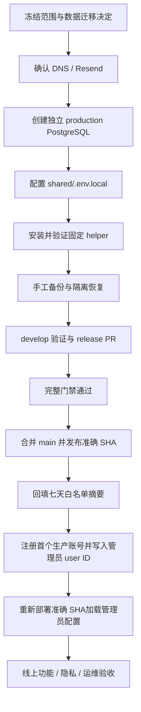

# Production 完整发布 Runbook

本文沉淀“将 development 的完整能力一次性晋级到 production”的可重复流程，覆盖分支收敛、DNS 与 Resend、独立 PostgreSQL、生产密钥、固定 deploy helper、加密备份、发布、回填、管理员初始化、线上验收与回滚。常规小版本仍遵循范围感知自动部署；只有首次启用生产能力、跨分支整体晋级、数据库/认证/域名变更或 helper 契约升级时才需要完整执行本 Runbook。

本文不保存任何密码、API key、Cookie、私钥、用户 ID、邮箱、森空岛 UID/昵称、真实 Box 或服务器登录凭据。示例中的占位符不能直接用于生产。

## 1. 当前固定拓扑

| 项目 | Production | Development |
| --- | --- | --- |
| 分支 | `main` | `develop` |
| GitHub Environment | `production` | `development` |
| 应用根目录 | `/opt/arknights-infra` | `/opt/arknights-infra-dev` |
| systemd | `arknights-infra` | `arknights-infra-dev` |
| Next 内部端口 | `127.0.0.1:4175` | `127.0.0.1:4275` |
| Funnel Nginx | `127.0.0.1:4176` | `127.0.0.1:4274` |
| 直连兼容 Nginx | `0.0.0.0:4174`，受 Host 限制 | 无公网入口 |
| PostgreSQL | `127.0.0.1:55432` | `127.0.0.1:55433` |
| 持久化目录 | `/var/lib/arknights-infra` | `/var/lib/arknights-infra-dev` |
| 主站 | `https://riic.autos` | 当前 development HTTPS Origin |
| 兼容入口 | `https://ark.riic.autos`永久跳转；既有 Tailscale Funnel 保留 | 既有 development Funnel |

Production 的 `BETTER_AUTH_URL`、`BETA_PUBLIC_ORIGIN`、`SKLAND_PUBLIC_ORIGIN` 与 GitHub Environment 的 `DEPLOY_PUBLIC_HEALTH_URL` 必须统一使用 `riic.autos`。内部端口、直连兼容端口、旧域名和 Tailscale 地址都不能写入这些公开 Origin。

## 2. 发布原则与停止条件

### 2.1 必须保持的原则

- Production 使用全新网站账号库，不复制 development 用户、Session、管理员、政策同意、云工作区、排班历史或森空岛绑定。
- Production 与 development 的数据库角色密码、Better Auth secret、Resend key、工作区主密钥和备份凭据全部隔离。
- 既有 production `SKLAND_SESSION_SECRET`长期保持稳定；轮换会使现有森空岛 Cookie 失效。
- 旧 production 运行记录和反馈目录继续保留；只回填当前七天内能通过白名单校验的摘要。
- Production 只有精确设置`SKLAND_FEATURE_ENABLED=1`才启用森空岛。改变该开关后必须重新构建，不能只重启旧构建。
- Production 始终强制`debugTools=false`和`rateLimit=true`。
- 数据库 migration 向前兼容；应用回滚不回滚已成功执行的 migration。
- 首期仅使用服务器本机 age 加密备份，不配置 restic/S3。该方案无法抵御服务器磁盘或整机损坏，是需要持续披露的已接受风险。

### 2.2 任一命中即停止发布

- DNS 或 Resend 域名仍未验证；
- API key、密码、Cookie、私钥或用户数据出现在 Git、Issue、PR、聊天或命令输出中；
- 数据库监听到`0.0.0.0`、公网 IP 或 Tailscale IP；
- production 与 development 复用了卷、账号、密码或应用密钥；
- helper 不是`root:root 0755`普通文件，或契约版本不匹配；
- migration、`auth:check`、完整质量门禁、备份恢复演练或公网健康检查失败；
- 待发布 SHA 与已评审、已验证 SHA 不一致；
- 发布前无法确认上一 release、回滚方式、磁盘空间或持久化目录所有权。

## 3. 总体流程



## 4. 阶段 A：冻结范围与建立证据

1. 记录 production 与 development 的当前分支 SHA、线上 `current`、服务状态、release 数量和磁盘空间。
2. 明确本次迁移清单和不迁移清单。默认只保留 production 既有私有运行/反馈文件，不迁移 development 账号或业务数据。
3. 记录数据库、域名、发信、森空岛、云同步、共享缓存与备份的目标策略。
4. 对所有需要用户交互或可能删除数据的验收单独标记。退出账号、撤销 Session、删除全部森空岛数据等破坏性验收必须取得明确授权，不能为了“完成清单”破坏刚建立的生产状态。
5. 从服务器、GitHub、DNS 和邮件控制台采集证据时只记录状态、计数、SHA、owner/mode 和公开域名，不复制密钥或真实用户内容。

建议使用下面的只读基线：

```bash
git fetch origin main develop
git status --short --branch
git rev-parse origin/main origin/develop
systemctl is-active arknights-infra
readlink /opt/arknights-infra/current
df -h /opt/arknights-infra
```

## 5. 阶段 B：DNS 与 Resend

### 5.1 先确认实际 DNS 管理方

不要根据注册商、历史截图或域名品牌猜测 DNS 服务商。先检查权威 NS，再以用户当前实际管理面板为准。本项目当前通过雨云管理`riic.autos`记录。

Production 域名要求：

- `riic.autos`指向 production HTTPS 主入口；
- `ark.riic.autos`只做永久跳转到主域名；
- `auth.riic.autos`只用于认证邮件发信；
- 80 端口统一`308`跳转到`https://riic.autos`。

### 5.2 配置发信子域

1. 在 Resend 添加`auth.riic.autos`。
2. 只按 Resend 控制台当前给出的值添加 SPF、DKIM 和 return-path 记录，不从其他项目复制。
3. 配置 DMARC。若`_dmarc.riic.autos`已存在且没有更具体的子域 DMARC，它会覆盖`auth.riic.autos`；无需为了形式重复添加`_dmarc.auth`。
4. 同时从公共 DNS 与 Resend 控制台确认域名已验证。
5. 创建 production 专用、仅允许发送且限制到`auth.riic.autos`的 API key。
6. From 固定为：

   ```text
   可露希尔基建终端 <noreply@auth.riic.autos>
   ```

7. 如果 key 曾进入聊天、截图、日志或剪贴板记录，立即撤销；重新创建受限 key，并通过标准输入或受保护环境文件安装，禁止把值写入命令行、仓库或临时脚本。

DNS 与 Resend 均验证成功前，不得开放 production 注册流程。

## 6. 阶段 C：独立 Production PostgreSQL

数据库部署资产位于[`deploy/postgres`](../deploy/postgres/README.md)。在服务器受保护目录安装已评审版本，以`example.env`创建不入库的`production.env`，并分别生成 bootstrap、runtime、migration、backup 四组随机密码。

```bash
cd /opt/arknights-infra-databases
sudo docker compose -f compose.yml up -d production
sudo docker compose -f compose.yml ps production
sudo ss -ltnp | grep 55432
```

验收要求：

- 容器 healthy；
- 只监听`127.0.0.1:55432`；
- 使用`production-data`独立卷；
- runtime 只有已提交表的 DML，不能 DDL；
- migration 可以执行已提交 migration；
- backup 只读且可以完成整个数据库的`pg_dump`；
- `PUBLIC`不能在`public` schema 建表。

在隔离数据库先运行：

```bash
npm run db:migrate
npm run auth:check
npm run test:auth-integration
```

`AUTH_INTEGRATION_DATABASE_URL`绝不能指向 production 或共享 development 数据库；集成测试会创建、修改和删除数据。

## 7. 阶段 D：Production 应用配置

Production 的非仓库配置位于：

```text
/opt/arknights-infra/shared/.env.local
```

文件使用`root:root 0600`或等效的最小可读权限。不要在终端打印文件全文。至少配置：

```text
APP_DEPLOYMENT_ENV=production
SKLAND_FEATURE_ENABLED=1
DATABASE_URL=postgresql://<prod-runtime-user>:<password>@127.0.0.1:55432/<prod-db>
DATABASE_MIGRATION_URL=postgresql://<prod-migration-user>:<password>@127.0.0.1:55432/<prod-db>
BETTER_AUTH_SECRET=<production专用且至少32字节的长期随机值>
BETTER_AUTH_URL=https://riic.autos
BETTER_AUTH_ADMIN_USER_IDS=
RESEND_API_KEY=<production专用受限key>
AUTH_EMAIL_FROM=可露希尔基建终端 <noreply@auth.riic.autos>
BETA_PUBLIC_ORIGIN=https://riic.autos
SKLAND_PUBLIC_ORIGIN=https://riic.autos
SKLAND_SESSION_SECRET=<保留既有production长期稳定值>
SKLAND_ALLOW_INSECURE_HTTP=0
BETA_BUSINESS_DB_ENABLED=1
BETA_BUSINESS_DB_READ_ENABLED=1
BETA_BUSINESS_FILE_READ_FALLBACK=1
ACCOUNT_CLOUD_SYNC_ENABLED=1
WORKSPACE_ACTIVE_KEY_VERSION=v1
WORKSPACE_MASTER_KEYS=<production专用版本化32字节主密钥JSON>
PLAN_CACHE_ENABLED=0
```

发布 helper 会把`shared/.env.local`复制到新 release 的`.env.local`。因此：

- 修改 shared 配置只会影响之后创建的 release；
- 单纯重启当前服务不会重新读取 shared 文件；
- 管理员 ID、Resend key 或其他运行时配置变更后，优先重新运行原已验证 SHA 的受保护部署流程；
- 除非是已明确授权并记录的紧急修复，不要直接修改当前 release 的环境快照。

## 8. 阶段 E：固定 Deploy Helper

服务器固定 helper：

```text
/usr/local/sbin/arknights-infra-prepare-release
/usr/local/sbin/arknights-infra-deploy
```

只在首次安装或不兼容升级时，从待合并、已评审 commit 原子安装：

```bash
sudo install -o root -g root -m 0755 scripts/prepare-release.sh /usr/local/sbin/arknights-infra-prepare-release.new
sudo install -o root -g root -m 0755 scripts/deploy-release.sh /usr/local/sbin/arknights-infra-deploy.new
sudo mv /usr/local/sbin/arknights-infra-prepare-release.new /usr/local/sbin/arknights-infra-prepare-release
sudo mv /usr/local/sbin/arknights-infra-deploy.new /usr/local/sbin/arknights-infra-deploy
```

逐个核对：

```bash
stat -c '%F %U:%G %a' /usr/local/sbin/arknights-infra-prepare-release /usr/local/sbin/arknights-infra-deploy
/usr/local/sbin/arknights-infra-prepare-release --contract-version
/usr/local/sbin/arknights-infra-deploy --contract-version
sha256sum /usr/local/sbin/arknights-infra-prepare-release /usr/local/sbin/arknights-infra-deploy
```

当前两个契约版本均为`1`。内部修复如果不改变参数、退出码、权限模型和副作用语义，不升级契约版本；不兼容修改必须成套更新脚本、工作流、测试和文档，并在合并前完成安装复核。

## 9. 阶段 F：本机 Age 加密备份与恢复演练

1. 创建专用`arkbackup`系统用户。
2. 为 production 生成独立 age recipient；私钥离线保存，服务器只保留 recipient 公钥。
3. 安装备份脚本和 systemd 模板，配置：

   ```text
   /etc/arknights-infra/db-backup-production.env
   /var/backups/arknights-infra/production
   ```

4. `DATABASE_BACKUP_URL`不含密码；密码放在受保护的`PGPASSWORD`环境项，避免出现在`pg_dump`进程参数。
5. 首期 production 不设置`RESTIC_REPOSITORY`和`RESTIC_PASSWORD_FILE`。
6. 手工执行一次：

   ```bash
   sudo systemctl start arknights-infra-db-backup@production.service
   systemctl status arknights-infra-db-backup@production.service --no-pager
   ```

7. 在绝不连接 production 的隔离 PostgreSQL 中，用离线私钥解密并恢复 custom dump；核对 migration、表数量、账号/业务行数和认证生命周期。
8. 恢复验证通过后启用计时器：

   ```bash
   sudo systemctl enable --now arknights-infra-db-backup@production.timer
   systemctl list-timers 'arknights-infra-db-backup@production.timer'
   ```

“备份 service 成功”不能代替恢复演练。至少每季度重复一次隔离恢复，并持续记录没有异地副本的风险。

## 10. 阶段 G：分支收敛、门禁与 Release PR

### 10.1 以后统一的 `develop → main` 晋级方式

完整能力晋级不再逐提交`cherry-pick`。从最新`origin/develop`建立专门 release 分支，把最新`origin/main`合入该分支，解决两边差异后向`main`创建 PR：

```bash
git fetch origin main develop
git switch -c release/develop-to-main-<YYYYMMDD> origin/develop
git merge --no-ff origin/main
git diff --check
git push -u origin release/develop-to-main-<YYYYMMDD>
gh pr create --base main --head release/develop-to-main-<YYYYMMDD>
```

冲突处理必须同时保留 develop 的完整产品能力与 main 独有的代理、发布、回滚和稳定性修复。PR 文件列表、左右提交历史和最终 tree 都要复核，不能把 development 密钥、数据或运行产物带入 main。

### 10.2 完整门禁

运行时、数据库、认证、森空岛或部署变更至少覆盖：

```bash
git diff --check
npm run check
npm run audit:security
npm run build
npm run test:production-client
npm run test:deploy
npm run test:solver-contract
npm run test:e2e
npm run test:e2e:production-profile
npm run test:e2e:webkit
```

并在隔离 PostgreSQL 执行 migration、`auth:check`和认证集成测试。`test:solver-contract`与 shell 发布测试以 Linux CI 结果为准。WebKit 可从`Frontend quality`的`workflow_dispatch`手动开启；手动工作流不会触发 deploy。

## 11. 阶段 H：合并并发布准确 SHA

1. 确认 PR 已评审、所有门禁通过、helper 已安装、DNS/Resend/数据库/备份前置条件全部完成。
2. 合并 release PR；记录 main merge SHA。
3. 只允许受保护的`main` push 工作流发布该 SHA。不要从本地工作区上传未合并文件。
4. GitHub Environment 需要审批时，先核对 SHA、目标环境和健康地址再批准。
5. helper 应先构建 release，再执行 production migration 与`auth:check`，最后原子切换`current`并重启；失败自动保留上一 release。
6. 发布完成后核对：

   ```bash
   readlink /opt/arknights-infra/current
   systemctl is-active arknights-infra
   ss -ltnp
   curl -fsS http://127.0.0.1:4175/api/health
   curl -fsS https://riic.autos/api/health
   ```

公网健康响应至少满足：

```text
success=true
data.status=ready
data.plannerReady=true
data.skland.available=true        # 仅本次显式开启时
data.features.debugTools=false
data.features.rateLimit=true
```

## 12. 阶段 I：回填、首个账号与管理员信任根

### 12.1 业务摘要回填

发布后只执行一次幂等回填：

```bash
npm --prefix /opt/arknights-infra/current run db:backfill-business
```

记录扫描、插入、已存在、跳过和数据库行数。脚本只处理当前七天内的白名单摘要；旧目录存在但插入数为 0 不一定是失败，必须结合七天窗口和跳过原因判断。不得为了增加数字而扩大扫描窗口或导入原始 Box/调试数据。

### 12.2 首个生产管理员

1. 在 production 注册运营网站账号，完成邮箱验证码并登录。
2. 使用 backup 只读账号查询 Better Auth `user.id`；不要输出密码、Session token 或无关用户字段。
3. 把确认的 user ID 写入 shared 配置中的`BETTER_AUTH_ADMIN_USER_IDS`。不得填写邮箱。
4. 重新运行原已验证 main SHA 的受保护部署流程，让新 release 复制 shared 环境快照。只重启当前 release 不会生效。
5. 验证`/admin/users`可访问，页面显示初始管理员，Session 列表可读取且不能在网页降级该账号。

## 13. 阶段 J：线上验收矩阵

| 范围 | 必须验证 |
| --- | --- |
| 域名与入口 | `riic.autos`可访问；`ark.riic.autos`永久跳转；80、443、4174、4175、4176与既有 Funnel 符合拓扑 |
| 健康与安全开关 | planner ready；森空岛状态匹配构建开关；debug 关闭；限流开启 |
| 认证邮件 | 注册验证码实际送达；未验证用户不能登录；登录/退出与密码重置链路可恢复 |
| 管理员 | 初始管理员按 user ID 生效；委派管理员不能扩权或影响初始管理员；Session 可撤销 |
| MAA 与求解 | 导入 Full E2/真实 MAA；生成三班；切换班次；刷新恢复；下载 MAA |
| 云工作区 | 政策同意、同步、历史、固定/取消固定、恢复和 Box 不匹配保护 |
| 森空岛 | 扫码、轮询、同步、状态页、求解、当前进驻比较；存在第二角色时再验证切换 |
| 删除操作 | 退出森空岛、删除全部数据、网站注销和 Session 撤销只在明确授权的测试账号执行 |
| 隐私 | 公开响应、日志、数据库、local/sessionStorage 不含凭据、明文数据库 Box、内部路径或调试字段；`document.cookie`看不到 HttpOnly 凭据 |
| 持久化 | `/var/lib/arknights-infra`、`cli-runs`、`feedback`目录未被 release 淘汰且所有权正确 |
| 备份 | 加密备份存在、timer active/enabled、隔离恢复记录完整 |
| release | `current`为预期 SHA；服务 active；最多当前加两个回滚 release；可用空间至少 3 GiB |

浏览器隐私审计要按公开 DTO 白名单判断。森空岛排班快照中的`operbox`是求解所需的最小公开字段，不是凭据；每条只允许`id`、`name`、`elite`、`level`、`own`、`potential`、`rarity`。森空岛 UID、完整状态、cred/token/Cookie、内部路径和 debug 字段仍禁止进入持久化、日志或数据库。

## 14. 回滚

### 14.1 应用 release 回滚

1. 确认上一 release 的目录名、`.release-sha`、owner 和完整性。
2. 原子把`current`切回上一 release。
3. 重启`arknights-infra`。
4. 重新验证内部与公网 health、Full E2、MAA 下载和持久化目录。
5. 保留失败 release、journal 和 request ID 证据，直到根因确认；只清理 helper 已验证的失败半成品。

### 14.2 数据库与功能开关

- 已执行的向前兼容 migration 保留，不随应用回滚执行 down migration。
- 关闭森空岛需要把 shared 中`SKLAND_FEATURE_ENABLED`设为`0`并重新构建发布。
- 云同步、数据库读取和缓存按启用顺序反向关闭；存在旧密文时不能删除历史工作区主密钥。
- 数据清理、DROP、卷删除和备份删除不属于应用回滚，必须单独授权。

## 15. 每次发布记录模板

```text
日期：
范围与 PR：
main merge SHA：
Frontend quality run：
额外 WebKit run：
production release：
helper owner/mode/contract/hash：
数据库容器/监听/卷：
migration/auth:check：
备份文件与隔离恢复：
回填扫描/插入/跳过/行数：
管理员 user ID 已配置：是/否（不记录实际 ID）
健康字段：
功能验收：
隐私审计：
持久化目录与 release 数量：
未执行的破坏性验收：
已接受风险：
回滚 release：
```

## 16. 2026-08-24 首次完整 Production 发布记录

本节只记录去敏后的发布证据，用于下一次发布对照，不代表未来可以跳过前置检查。

| 项目 | 结果 |
| --- | --- |
| Release PR | [#203](https://github.com/KnightCodeSquareMatrix/ArknightsInfraCalc-v2_beta_test_frontend/pull/203)，已合并 |
| main merge SHA | `94a8f1b9fb19d905ae11f0246292eed5b5fe4ab9` |
| 主工作流 | [Frontend quality 32727385592](https://github.com/KnightCodeSquareMatrix/ArknightsInfraCalc-v2_beta_test_frontend/actions/runs/32727385592)，Core、Chromium、production profile、deploy 全部通过 |
| 额外兼容门禁 | [Frontend quality 32736856514](https://github.com/KnightCodeSquareMatrix/ArknightsInfraCalc-v2_beta_test_frontend/actions/runs/32736856514)，WebKit、重复 Core/Chromium 全部通过，deploy 按设计跳过 |
| Production release | `20260824124656-94a8f1b9fb19` |
| 域名 | `riic.autos`为主入口；`ark.riic.autos`返回永久跳转；DNS 在雨云管理 |
| Resend | `auth.riic.autos`验证通过；暴露过的旧 key 已撤销；新 key 仅发送且限制到 production 发信域 |
| PostgreSQL | 独立 production 容器、卷与四类账号；仅`127.0.0.1:55432`监听 |
| 数据迁移 | 全新 production 账号库；未复制 development 用户、Session、工作区或森空岛绑定 |
| 回填 | 当前七天没有符合条件的旧摘要，插入 0；既有私有运行/反馈目录完整保留 |
| 管理员 | 首个已验证网站账号按 Better Auth user ID 配置为初始管理员；未记录邮箱或实际 ID |
| 业务数据 | 验收后存在账号、Session、政策同意、加密 Box 快照、工作区、排班历史和一条 HMAC 森空岛绑定；数据库没有森空岛 UID/昵称/凭据列 |
| 森空岛 | 扫码、轮询、同步、状态页、求解和当前进驻比较通过；账号只有一个角色，因此没有实际切角 |
| 隐私审计 | 公开响应、浏览器存储、数据库与服务日志未发现凭据、Token、明文数据库 Box、调试字段或内部路径 |
| 备份 | production age 加密备份、隔离恢复和 systemd timer 通过；未配置异地仓库 |
| 运维状态 | 4174/4175/4176/443监听符合拓扑；服务 active；3 个合法 release；磁盘空间高于最低阈值 |
| 未执行操作 | 为保留刚建立的真实绑定，未在线执行森空岛退出/删除全部数据和当前网站 Session 撤销；这些路径由自动化覆盖，真实破坏性复验需使用专用测试账号 |

本次最重要的经验是：DNS 管理方必须以权威记录和用户实际面板确认；暴露的 API key 必须立即撤销；`shared/.env.local`是后续 release 的输入而不是当前进程动态配置；WebKit 需要在完整晋级时手动补跑；备份只有在隔离恢复成功后才算可用。
